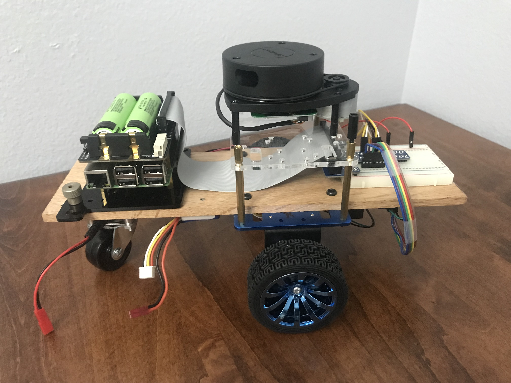
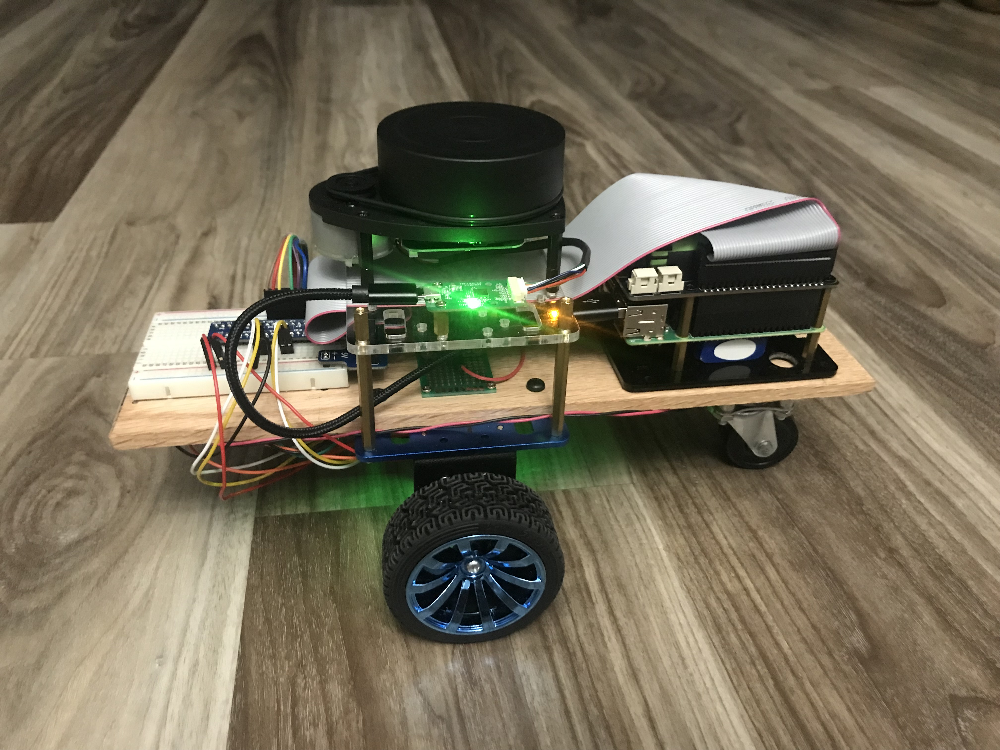
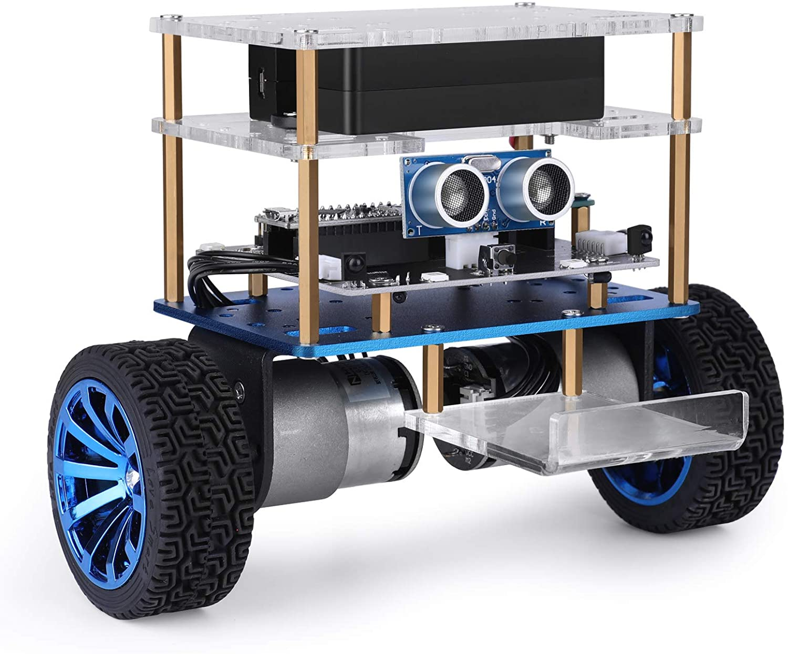
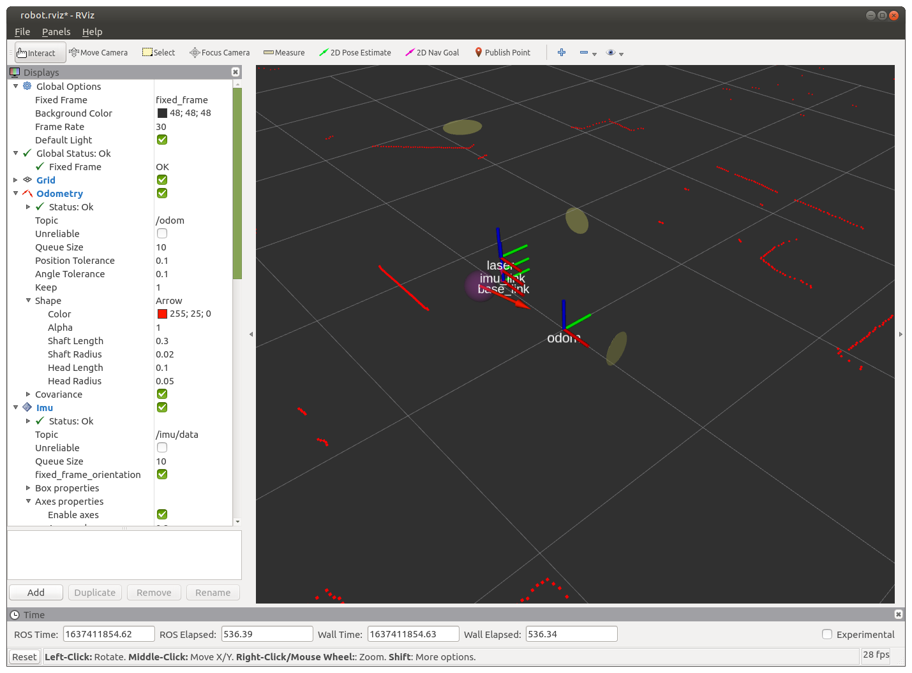

# Do-it-yourself differential drive ROS robot
This project started out when my wife bought me a Raspberry-Pi 4 (w/ 8GB RAM) for my birthday.
At the time, I was curious about learning ROS and I also wondered if the Raspi4
would be suitable for use as a desktop computer. Could the new Raspi handle the
rigors of running ROS, and if so, wouldn't that be great to enable me to pursue my ROS education?

The answer to both questions turned out to be YES, and so this inital curiosity has led me to tackle this project.

This project actually uses a Raspberry Pi 3B+ computer aboard the robot, while
the Raspi4 has found use as my desktop computer. Here's an early picture of the robot before the IMU was in place.



And here it is fully functional, powered up and ready to go.



With my background in mechanical engineering, I have learned to value "elegant simplicity" in design, with a preference for readily available components, assembled with minimal modification in a configuration that makes them all really easy to access. If a component goes bad, changing it out is fast and simple. I try to avoid the situation where a component is "buried" deep inside and hard to access.

The most complicated part I had to make was the 1/4 x 5 x 12 inch long piece of oak that I purchased from Home Depot. Using only moderate precision, I drilled holes wherever they were needed. Everything else is readily available as an off-the-shelf componenent. For example, the entire wheel/motor/encoder assembly including the lower blue anodized plate, the upper clear plastic plate and the brass standoffs came from an [Elegoo Tumbller](https://www.amazon.com/dp/B07QWJH77V?psc=1&ref=ppx_yo2_dt_b_product_details).



### Configuring ROS on board the robot
The `my_robot` folder contains all the code that goes in robot's catkin_ws/src directory.

[Here](setup-operate/setup-2nd-computer.md) are the details of the configuration and setup of the robot onboard computer.

After starting roscore on the desktop (raspi4), I ssh to robot, start pigpiod, then launch all of robot's onboard nodes.

```
ssh ubuntu@robot
sudo pigpiod
roslaunch bringup bringup.launch
```
This produces the following output summary. 
```
ubuntu@robot:~$ roslaunch bringup bringup.launch
... logging to /home/ubuntu/.ros/log/9399132c-4aa6-11ec-9ee1-d314949a63f2/roslaunch-robot-7859.log
Checking log directory for disk usage. This may take a while.
Press Ctrl-C to interrupt
Done checking log file disk usage. Usage is <1GB.

started roslaunch server http://robot:46347/

SUMMARY
========

PARAMETERS
 * /robot_pose_ekf/base_footprint_frame: base_footprint
 * /robot_pose_ekf/debug: False
 * /robot_pose_ekf/freq: 30.0
 * /robot_pose_ekf/gps_used: False
 * /robot_pose_ekf/imu_used: True
 * /robot_pose_ekf/odom_used: True
 * /robot_pose_ekf/output_frame: odom
 * /robot_pose_ekf/self_diagnose: False
 * /robot_pose_ekf/sensor_timeout: 1.0
 * /robot_pose_ekf/vo_used: False
 * /ros_imu_bno055_node/frame_id: imu_link
 * /ros_imu_bno055_node/frequency: 50
 * /ros_imu_bno055_node/operation_mode: IMU
 * /ros_imu_bno055_node/oscillator: INTERNAL
 * /ros_imu_bno055_node/reset_orientation: True
 * /ros_imu_bno055_node/serial_port: /dev/ttyUSB_IMU
 * /ros_imu_bno055_node/use_magnetometer: False
 * /ros_imu_bno055_node/use_temperature: False
 * /rosdistro: noetic
 * /rosversion: 1.15.13
 * /rplidarNode/angle_compensate: True
 * /rplidarNode/frame_id: laser
 * /rplidarNode/inverted: False
 * /rplidarNode/serial_baudrate: 115200
 * /rplidarNode/serial_port: /dev/ttyUSB_LIDAR

NODES
  /
    mtr_encdr (wheels/encoder_publisher.py)
    odometer (odom_pub/odometer_publisher.py)
    robot_pose_ekf (robot_pose_ekf/robot_pose_ekf)
    ros_imu_bno055_node (ros_imu_bno055/imu_ros.py)
    rplidarNode (rplidar_ros/rplidarNode)
    tf_base_link_imu (tf2_ros/static_transform_publisher)
    tf_base_link_laser (tf2_ros/static_transform_publisher)
    tf_fixed_odom (tf2_ros/static_transform_publisher)
    tf_footprint_link (tf2_ros/static_transform_publisher)

ROS_MASTER_URI=http://raspi4:11311/

process[mtr_encdr-1]: started with pid [7867]
process[ros_imu_bno055_node-2]: started with pid [7868]
process[rplidarNode-3]: started with pid [7869]
process[tf_fixed_odom-4]: started with pid [7870]
process[tf_footprint_link-5]: started with pid [7874]
process[tf_base_link_imu-6]: started with pid [7879]
process[tf_base_link_laser-7]: started with pid [7881]
[ INFO] [1637483996.013958568]: RPLIDAR running on ROS package rplidar_ros. SDK Version:1.12.0
process[odometer-8]: started with pid [7886]
process[robot_pose_ekf-9]: started with pid [7891]
RPLIDAR S/N: DEA4EDF9C7E29BCEA7E39EF24E774304
[ INFO] [1637483998.555474957]: Firmware Ver: 1.29
[ INFO] [1637483998.555666942]: Hardware Rev: 7
[ INFO] [1637483998.557988834]: RPLidar health status : 0
[INFO] [1637483998.634457]: /ros_imu_bno055_node ready!
[ INFO] [1637483999.137056162]: current scan mode: Sensitivity, max_distance: 12.0 m, Point number: 7.9K , angle_compensate: 2
[INFO] [1637483999.355721]: IMU successfully reset
[INFO] [1637483999.584469]: Configuration mode activated
[INFO] [1637483999.606832]: Units configured successfully
[INFO] [1637483999.654977]: Axis configured successfully
[INFO] [1637483999.719198]: Calibration loaded successfully
[INFO] [1637483999.767136]: INTERNAL oscillator configured successfully
[INFO] [1637483999.983660]: Operation mode configured successfully
[INFO] [1637484000.010147]: IMU is working now in IMU mode!
```

### The robot's position and orientation within its environment can be visualized using RVIZ.



But this is just the beginning!

### Using the ROS Navigation Stack
This is where ROS really shines. This is what made me realize that there is no future in me trying to reinvent all the robotics algorithms for myself. With ROS, all the heavy lifting has been done. Just issue a couple simple commands and you get a map. A couple of clicks in RVIZ and ROS will take your robot from point A to point B (on the map that it made) without colliding with anything along the way, using sophisticated algoithms such as:
* SLAM / Mapping
* Localization using AMCL
* Path Planning to find the best route from initial pose to goal pose.

### Configuring ROS on the Raspi4
The `robo_nav` folder contains all the code that goes in raspi4's catkin_ws/src directory.
And there really isn't very much there. Just some launch files, parameters, and maps.

[Here](setup-operate/ubuntu-install.md) are the details of the setup and configuration of the raspi4 computer.

To operate the robot, refer to these [operating instructions](setup-operate/operate-robot.md).
### DIY robot makes its maiden voyage
On 11/27/21, the DIY robot made its first trip under the control of the ROS Navigation Stack. It wasn't a very smooth or efficient looking route but the robot managed to complete its first trip to a goal pose specified in RVIZ.


### Navgatiion tuning
As I got started working on navigation tuning, I was getting a lot of errors that seemed like they may have resulted from information "drop outs" from the robot.

Odometry, IMU and Laser topics were blinking red on RVIZ, apparently not always arriving from the robot computer. As shown in more detail in [Nav Parameter Tuning](nav_param_tuning/nav_parameter_tuning_notes.md), the CPU of the raspi4 was topped out at 100%.

-Doug
