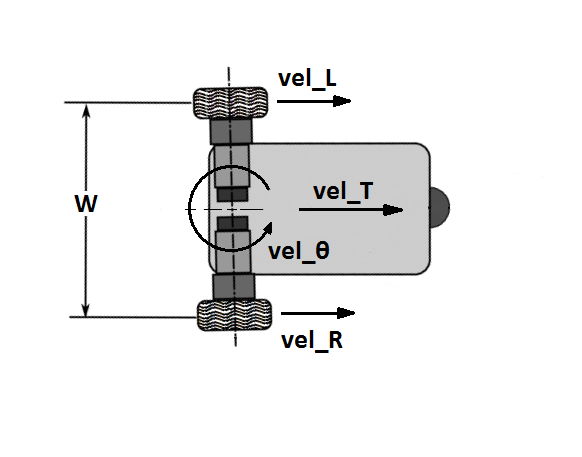

# Basic kinematics of differential drive vehicles
The differential drive configuration consists of exactly 2 identical but independently controlled drive wheels mounted coaxially and spaced apart from each other by a distance known as the track width, **W**. Each of the wheels, when driven in the forward direction, will impart a velocity (vel_L or vel_R respectively) at the point of contact with the floor. In the figure below, the vehicle is shown with its front pointed to the right. It has exactly two independent degrees of freedom:
1. Translation (It can drive straight ahead or straight back, perpendicular to the axis of the wheels)
2. Rotation (It can rotate about the Z axis located mid-way between the two wheels)

Our vehicle will receive messages on the cmd_vel topic specifying the speed at which it is to drive in both of these two degrees of freedom. These speeds are:
* **vel_T** (meters/second)
* **vel_$`\theta`$** (radians/second)

### We need to be able to convert the commanded vehicle speed to wheel speeds vel_L and vel_R

To me, the most intuitive way to think about this problem is to divide it into 2 separate and independent problems, then combine the results by superposition. We can use superposition because the vehicle's 2 degrees of freedom are **independent**.

First, consider pure translation with zero rotation:
* In the case of pure translation (vel_$`\theta`$ = 0)

    * $`vel\_R = vel\_T`$
    * $`vel\_L = vel\_T`$

Hopefully, it is still clear that even with a non-zero value of vel_$`\theta`$, vel_T is equal to the average of vel_L and vel_R. (Imagine a cart being drawn by 2 horses side by side.) Stating this in an equation gives:

$`vel\_T = (vel\_R + vel\_L) / 2`$

Next consider the case where the vehicle is turning in place. (The value of vel_T equals zero.) Hopefully, your intuition will tell you that if vel_$`\theta`$ is positive, then  vel_R is also positive and they are related by the moment arm W/2. It should also be clear that vel_L must be of equal magnitude but in the opposite direction to vel_R.

* In the case of turning in place (vel_T = 0):
    * $`vel\_R = (vel\_\theta * W/2)`$
    * $`vel\_L = - (vel\_\theta * W/2)`$

Now we can use the principle of superposition to combine these two cases to come up with equations that are good for the general case of combined translation and rotation.

$`vel\_R = vel\_T + (vel\_\theta * W/2)`$

$`vel\_L = vel\_T - (vel\_\theta * W/2)`$

### Alternatively, if we know the wheel velocities, we can calculate the resulting vehicle velocities. (We already found the first equation.)

$`vel\_T = (vel\_R + vel\_L) / 2`$

$`vel\_\theta = (vel\_R - vel\_L) / W`$

