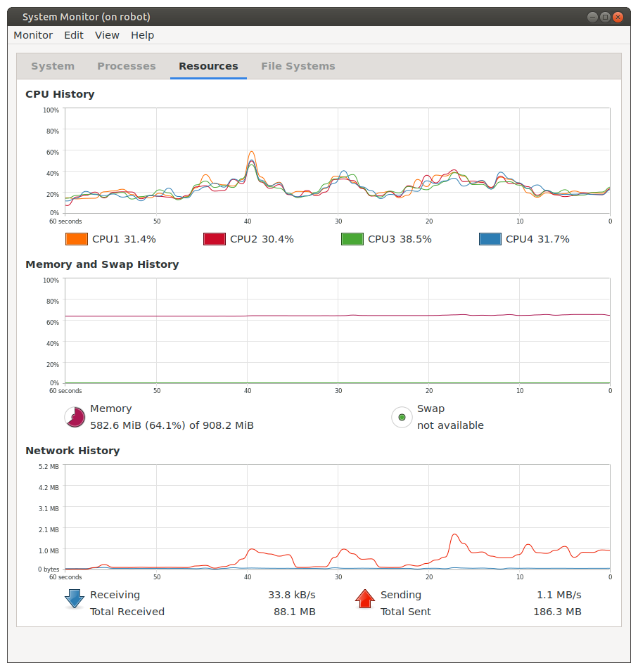

# Issues encountered along the way while building the robot
ROS is big. It encompasses a lot of very useful and powerful software. So there is no way around the truth that there will be lots of places where you can get stuck when coming up the learning curve.
Here is my retrospective recollection of some of the "learning opportunities" I encountered as I was building the DIY Robot and how I eventually resolved whatever it was that blocked my progress. I do this for the benefit of both my "future self" as well as for others who may be on a similar learning trajectory.

* **[RPLidar A1](http://wiki.ros.org/rplidar)** - No problems whatsoever. This works perfectly right out of the box. I set up a udev rule so the ROS node will be able to find it at /dev/ttyUSB_LIDAR.

* **[Bosch BNO055 IMU](http://wiki.ros.org/ros_imu_bno055)** - On [a previous robot](https://github.com/dblanding/lidar-scan-map) I used the Bosch BNO08x IMU in RVC mode which just published Euler angles and worked pretty well for that. However, on this project, I needed to publish IMU data on the ROS /imu topic, so my selection of IMU was based not so much on the IMU device itself, but more on how well the available libraries worked with ROS. This made me decide on using the older Bosch BNO055 device for which I found a very good [ROS library](https://github.com/RoboticArts/ros_imu_bno055). Like the lidar module, this also plugs into a USB port, so I wanted to set up a udev rule allowing the ROS node to find it at /dev/ttyUSB_IMU. This required editing the file imu_ros.py changing line 96 from:

`self.serial_port = rospy.get_param(self.node_name + '/serial_port','/dev/ttyUSB0')`

to 

`self.serial_port = rospy.get_param(self.node_name + '/serial_port','/dev/ttyUSB_IMU')`

* **Sensor Fusion** - Although the orientation part of my wheel odometry was pretty good, I decided to use robot_pose_ekf to fuse the imu data to make it even bettter. However, getting this to work properly was a stubborn ordeal. I used `rosrun robot_pose_ekf wtf.py` to help figure it out. Eventually, I had to do these things to get it to work:
    * In the /imu/data message publisher:
        * I had to normalize the quaternions coming from the imu publisher. ((x, y, z, w) were all integers between 0 - 16,384)
        * I had to get rid of the '-1' values in the first element of the covariance matrices.
    * In the odometry message publisher:
        * I had to seed the diagonal elements of the covariance matrix with small (non-zero) values. (0.01)
        * I had to remove (comment out) the tf broadcaster broadcasting transforms between base_link and odom. (robot_pose_ekf has that covered.)
    * I initially had the odometry-publisher node and robot-pose-ekf nodes on my desktop computer. The idea was to unburden the robot's on-board computer. But this was causing some timing-related warnings. So I moved those nodes onto the robot's Raspberry Pi 3B+ and the timing warnings went away. It had no problem handling the load.
    * Changed odom pub rate from 4 Hz to 10 Hz (IMU pub rate is 50 Hz)
* After I wrote my **odometry_publisher** node, I noticed that while operating under the control of the navigation stack, my robot moved smoothly when travelling in the positive X direction  on the map but moved very stutteringly in the negative X direction. I eventually discovered that I had botched the Twist part of the message being published in the /odom topic. As it turns out, the velocities are supposed to be referred to the child frame (base_link), not the odom frame.
* At one point, I encountered a problem where the **catkin_make** command failed to compile all the packages in the catkin workspace. Thanks to Lloyd Brombach for identifying the problem. The solution is explained [here](https://answers.ros.org/question/54178/how-to-build-just-one-package-using-catkin_make/). I had unwittingly followed some online advice to use the command `catkin_make --only-pkg-with-deps <target_package>` and didn't realize that I needed to follow this with the command `catkin_make -DCATKIN_WHITELIST_PACKAGES=""`.
* At one point, as I was pulling my hair out trying to figure out a problem with the robot's behavior, Lloyd offered this observation about roboticists:
> Robotics is for the very determined and persistent

I would have to agree. But in the end, I would have to say that it's worth it. Once I got the robot working to autonomously find its way around the house under the control of the ROS Navigation Stack, I used the mate-system-monitor to display the robot's cpu load on my desktop computer. The robot's RasPi3B+ was easily handling the load while finding its way around the house from point to point.

