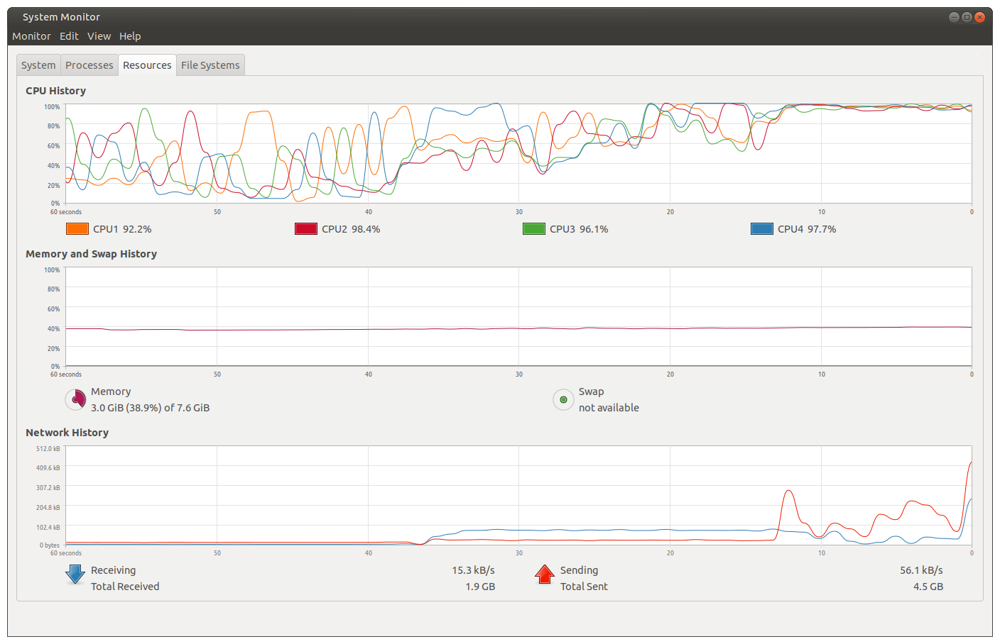
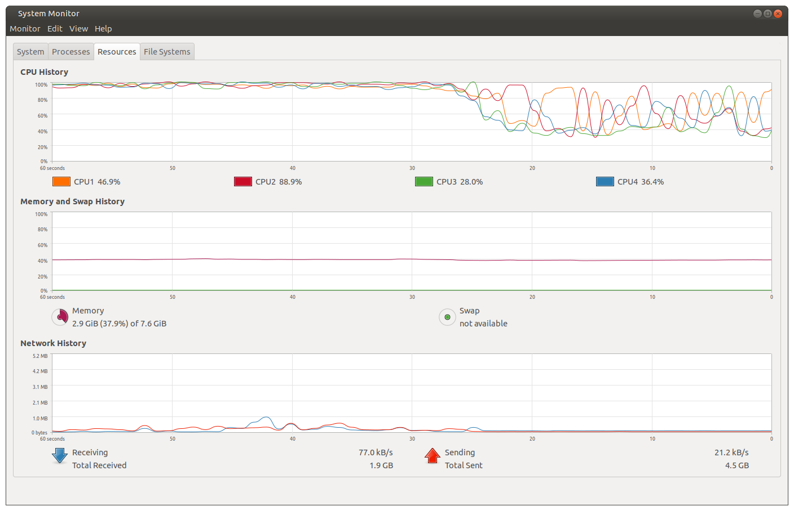
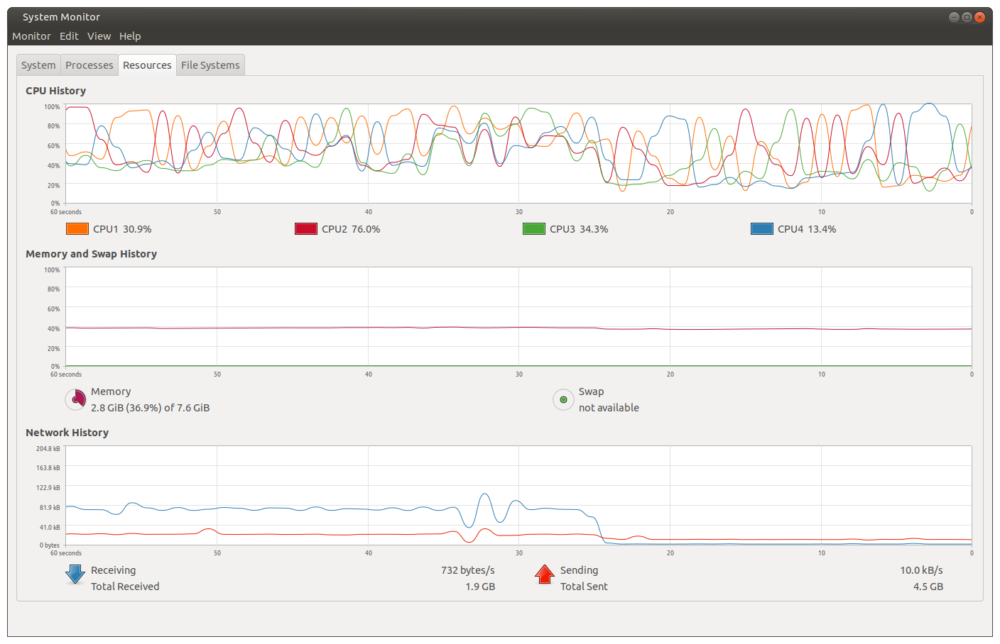
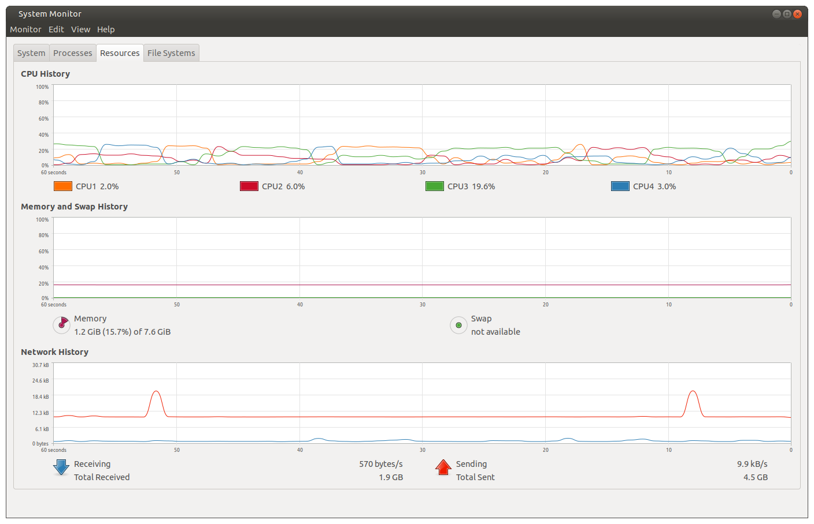

## Progress
12/3/21 Continuation from [nav_parameter_tuning_notes.md](nav_parameter_tuning_notes0.md) which was getting to be a large file.

I have noticed that when there is a rash of errors in the Navigation node, it seems to coinicide with these 3 topics blinking **red** in RVIZ:
* laser scan
* IMU
* Odometry

A closer look shows the reason: `No transform to fixed frame [map]. Tf error: Lookup would require extrapolation into the future.`

When I shut down the navigation nodes launched on raspi4, the laser scan, IMU & Odometry topics no longer blink red in RVIZ. It's as if raspi4 is getting overloaded when it has to do 2 things at once.

So I then launched the system monitor to have a look at CPU load. In this first screenshot, I launched RVIZ about 40 seconds ago, then launched the Navigation nodes around 15 seconds ago. You can see where all four cores of the cpu are now maxed out.

In the second screenshot, you can see where I hit Ctrl-c to kill the navigation nodes after which RVIZ remains running.

Finally, in this third screenshot, I killed RVIZ at roughly 25 seconds ago. There is actually quite a lot of other stuff still running on each of 5 workspaces. 

For reference, this next screenshot shows the system monitor with nothing else going on except 4 termnial windows: roscore and 3 idle ones.

